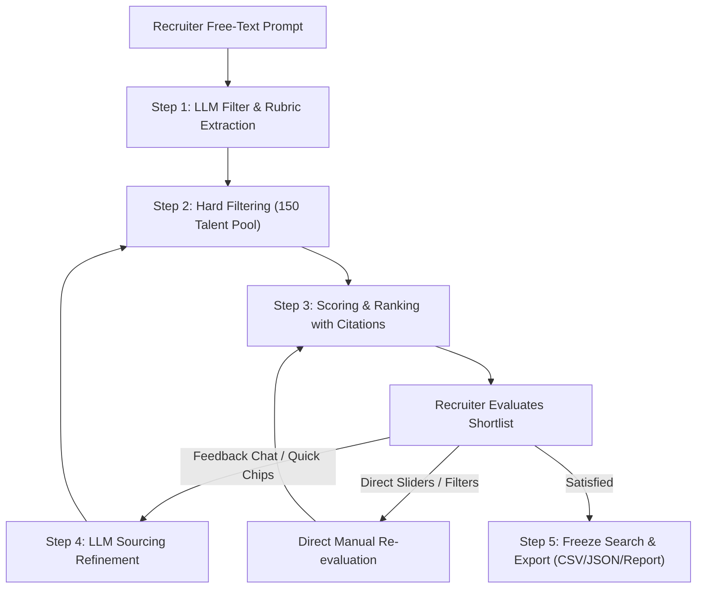

# Flexiple AI Recruiter: The Sourcing Refinement Loop

An enterprise-grade, full-stack AI Sourcing and Candidate Evaluation platform built for the **Flexiple Engineering Challenge**. 

This application implements the complete **Sourcing Refinement Loop**: transforming free-text recruiter hiring requirements into structured objective filters and subjective fit rubrics, executing dynamic filtering across a 150-profile candidate talent pool, scoring and ranking candidates with verifiable field citations, iteratively refining criteria via conversational recruiter feedback, and locking the search in a frozen summary with multi-format exports.

---

## ⚡ Single-Command Quick Start (Yarn Monorepo)

You can run **both the backend and frontend simultaneously with a single command** from the monorepo root using Yarn.

### 1. Install Monorepo Dependencies
```bash
# In the root repository directory
yarn install
```

### 2. Configure Environment Variables
Copy `.env.example` to `.env`:
```bash
cp .env.example .env
```

Set your **`GEMINI_API_KEY`** in `.env` (or in `apps/backend/.env`):
```env
GEMINI_API_KEY=your_google_gemini_api_key_here
PORT=4000
NODE_ENV=development
```
> **Note**: If no API key is provided, the backend seamlessly falls back to **Smart Heuristic Grounding Mode**, ensuring full functionality out of the box.

### 3. Run Monorepo (Single Command)
```bash
# Runs NestJS Backend (port 4000) and Next.js Frontend (port 3000) concurrently
yarn dev
```

- **Frontend Application**: [http://localhost:3000](http://localhost:3000)
- **Backend API**: [http://localhost:4000/api](http://localhost:4000/api)

#### Production Build & Run:
```bash
yarn build
yarn start
```

#### Run Typechecks & Tests:
```bash
yarn typecheck
yarn test
```

---

## 🎯 The Sourcing Refinement Loop: Step-by-Step



### 1. Natural Language to Filters & Rubric
- **Input**: The recruiter enters natural search requirements (e.g. *"RDS developers with 4-7 years of experience who have worked at startups, for a role based in Bangalore"* or *"Engineers who worked at Big 4 consulting firms"*).
- **Extraction**: The server-side LLM extracts:
  - **Objective Filters**: `skills`, `min_years_experience`, `max_years_experience`, `locations`, `company_types` (`startup`, `scaleup`, `enterprise`, `agency`), `target_companies`.
  - **Subjective Fit Rubric**: Weighted evaluation dimensions (`0-100%`), positive signals, negative signals, and explicit dealbreakers.

### 2. Hard Filtering on Candidate Talent Pool
- Evaluates against the local **150 candidate profile dataset** (`profiles.json`).
- Enforces strict constraints for requested target companies, experience ranges, company tiers, and core technical skills.
- Handles 0-match edge cases gracefully with an informative empty state and 1-click exploration pills for available companies in the pool.

### 3. Match Scoring with Grounded Citations
- Evaluates filtered candidates against the subjective rubric with a comprehensive match score (`0-100%`) and fit tiers (*Strong Match*, *Good Match*, *Borderline*, *Unlikely*).
- **Verifiable Citations Only**: Match explanations explicitly cite concrete fields (`years_experience`, `current_company`, `skills`, `summary`, `past_companies`) without AI hallucination.

### 4. Conversational Recruiter Refinement
- Recruiters provide feedback naturally in the refinement chat (e.g. *"Candidate 1 is too junior, 2 and 4 are right, also look for scaleups"*).
- The LLM updates filters and rubric weights, explains **what changed and why**, and re-ranks profiles in real time.
- Recruiters can also directly adjust filter pills, experience sliders, and criteria weights on the left panel.

### 5. Search Freeze & Export
- Once the shortlist is finalized, the recruiter clicks **"Export Shortlist"** to lock the search state.
- Generates a permanent snapshot containing:
  - Frozen objective filters & rubric criteria
  - Shortlisted candidate profiles with scores and cited facts
  - 1-click export to **CSV**, **JSON**, and a formatted **Executive Markdown Report**.

---

## 👥 Candidate Talent Pool: 150 Diverse Profiles

The dataset has been expanded to **150 rich, realistic candidate profiles** (`p01` through `p150`) across 20+ specialized industries, tech stacks, and company tiers:

| Domain & Category | Representative Companies | Tech Stacks & Roles | Sample Candidate Profiles |
| :--- | :--- | :--- | :--- |
| **Generative AI & LLMs** | Sarvam AI, Krutrim, Microsoft Research, OpenAI, Adobe | PyTorch, Transformers, LangChain, vLLM, CUDA, LoRA | `p101` Dr. Aditya Sen, `p83` Dr. Aryan Sengupta, `p114` Dr. Deepthi Nambiar |
| **Enterprise Databases & Oracle** | Oracle Corporation, OCI, Sun Microsystems | Oracle 19c, RAC, Exadata, Autonomous DB, PL/SQL | `p149` Venkatachalam Iyer, `p150` Balaram Naidu, `p42` Naveen Suri |
| **High-Frequency Trading & Quant** | Graviton Research, Citadel, Jane Street, Tower Research | C++, Low Latency, Kernel Bypass, FPGA, Linux Internals | `p108` Utkarsh Aggarwal, `p109` Akash Singhal |
| **Big 4 & Strategy Consultancies** | Deloitte, PwC, EY, KPMG, McKinsey Digital, Bain & Co | Cloud Strategy, Digital Advisory, Spring Boot, AWS RDS | `p49` Siddharth Varma, `p50` Aishwarya Ramanathan, `p51` Gaurav Singhal |
| **Mobile (iOS / Android / Flutter)** | Apple, Uber, Blinkit, Swiggy, Dream11 | Swift, SwiftUI, Kotlin, Jetpack Compose, Flutter, Dart | `p102` Siddhant Kapoor, `p103` Nandini Deshpande, `p104` Devendra Verma |
| **Frontend & Graphics Architects** | Canva, Disney+ Hotstar, Barclays, GitLab | React, Next.js, WebGL, Three.js, Vue 3, Angular Microfrontends | `p105` Varun Malhotra, `p106` Pooja Hegde, `p107` Arjun Kulkarni |
| **Unicorns & Fintech Scaleups** | Razorpay, CRED, Swiggy, Zepto, Blinkit, Groww, Meesho | Go, Node.js, PostgreSQL, Redis Cluster, Kafka | `p01` Ananya Rao, `p110` Sanjana Roy, `p126` Aman Gupta |
| **Healthtech & Biotech** | Innovaccer, Practo, Tata 1mg, PharmEasy | FHIR / HL7, HIPAA, WebRTC, FastAPI, PostgreSQL | `p119` Shruti Mukherjee, `p120` Gokul Chandran, `p121` Manish Tewari |
| **EdTech & Streaming** | PhysicsWallah, Unacademy, Eruditus, Coursera | HLS Video Streaming, WebSockets, Next.js, Django | `p122` Ankit Srivastava, `p123` Meera Venkatesh |
| **Cloud Security & Infrastructure** | Zscaler, Palo Alto Networks, Databricks, PingCAP | Zero Trust, IAM, Vault, Rust, Raft Consensus, eBPF | `p115` Ganesh Subramanian, `p135` Mayank Aggarwal, `p136` Nikhil Chhabra |
| **Enterprise ERP & CRM** | SAP Labs India, Salesforce, ServiceNow | ABAP on HANA, Apex/LWC, ServiceNow Glide, IntegrationHub | `p130` Sudhir Chakraborty, `p131` Venkat Rao, `p132` Kavita Reddy |
| **Hardware, Automotive & Embedded** | Bosch Engineering, Qualcomm, NVIDIA | Embedded C, AUTOSAR, CAN Bus, RTOS, CUDA | `p139` Rameshwar Patil, `p140` Kishore Reddy, `p141` Dr. Anirudh Bhattacharya |

---

## 🎨 UI & UX Design System

1. **Strict Match Mode vs. Smart Expansion Toggle**:
   - 🛡️ **Strict Match (Default)**: Enforces hard filtering on requested target companies, exact skills, and specific fields. If a candidate didn't work at the requested company or lacks the exact skill, they are excluded. If 0 candidates exist, an informative zero-match state is surfaced immediately with 1-click retry options.
   - 🌐 **Smart Expansion Mode**: Intelligently broadens search when requested. Surfaces candidates from sibling company tiers (*e.g., enterprise database engineers from SAP Labs / Walmart DB infra when searching Oracle*), adjacent domain keywords, and transferable technical skills with clear `Transferable Match` badges.
2. **Low-Contrast Dark Mode**: Designed with a calm, eye-friendly `#111215` / `#18191e` dark palette and muted zinc typography to prevent eye fatigue during high-volume recruiting sessions.
3. **100% HR-Friendly Recruitment Terminology**: Completely free of developer and AI jargon. Clean terms like *"Find Candidates"*, *"Match Score"*, *"Shortlist"*, *"Pass"*, *"Refine Criteria"*, and *"Export Shortlist"*.
4. **Interactive Candidate Actions**: 1-click Shortlist and Pass buttons, detailed profile modal inspect views, and company tier badges (*Startup, Scaleup, Enterprise, Consulting*).
5. **Informative Zero-Match State**: When no profiles match strict parameters, an empty state clearly explains the criteria and presents clickable pills to explore available companies in the pool or switch to Smart Expansion in 1 click.

---

## 🏛️ Monorepo Architecture

```
FlexipleAiHR/
├── package.json                          # Monorepo concurrent runner (npm run dev / npm start)
├── .env.example                          # Environment variables template
├── README.md                             # Project documentation
│
├── apps/
│   ├── backend/                          # NestJS (Port 4000)
│   │   └── src/
│   │       ├── main.ts                   # Bootstraps API with validation pipes & CORS
│   │       ├── common/                   # Global filters, JSON repair, fallback helpers
│   │       └── modules/
│   │           ├── candidates/           # Candidate data provider
│   │           │   ├── data/profiles.json # 150 diverse candidate profiles
│   │           │   ├── services/         # CandidatesService
│   │           │   └── controllers/      # CandidatesController (/api/candidates)
│   │           └── sourcing/             # Core Sourcing Engine
│   │               ├── constants/        # Centralized Industry Taxonomy (Clusters, Domains)
│   │               ├── controllers/      # SourcingController (/api/sourcing)
│   │               ├── services/         # SourcingService, LlmService, FilterEngine, RankingService
│   │               ├── entities/         # CandidateProfile, SearchFilters, FitRubric, ScoredCandidate
│   │               ├── dtos/             # InitialSearchDto, RefineSearchDto, UpdateFiltersDto
│   │               └── prompts/          # Structured Prompts (Filter extraction, scoring, refinement)
│   │
│   └── frontend/                         # Next.js 14 App Router (Port 3000)
│       └── src/
│           ├── app/                      # layout.tsx, page.tsx, globals.css
│           ├── components/
│           │   ├── search/               # SearchBar & quick presets
│           │   ├── filters/              # FilterRubricPanel (Live filter & rubric editor)
│           │   ├── candidates/           # CandidateCard, CandidateList, CandidateModal
│           │   ├── chat/                 # RefinementChat (Conversational feedback loop)
│           │   ├── freeze/               # FreezeModal (Shortlist locked summary & exports)
│           │   ├── states/               # ThinkingState, EmptyState, ErrorState
│           │   └── common/               # Header, Footer, Badges
│           ├── redux/                    # Store, sourcingSlice, chatSlice, uiSlice
│           └── services/                 # SourcingApiService & HTTP client
```

---

## 📡 API Reference

| Endpoint | Method | Description |
| :--- | :--- | :--- |
| `/api/sourcing/status` | `GET` | Health check & active LLM provider status |
| `/api/sourcing/search` | `POST` | Initial natural language search → Filters, Rubric & Top 5 Ranked Candidates |
| `/api/sourcing/refine` | `POST` | Conversational feedback refinement → Updated Criteria & Re-ranked Results |
| `/api/sourcing/reevaluate` | `POST` | Direct manual filter & rubric slider adjustments |
| `/api/sourcing/freeze` | `POST` | Generate frozen search summary snapshot & export payloads |
| `/api/candidates` | `GET` | Retrieve candidate pool with optional pagination |
| `/api/candidates/stats` | `GET` | Overview statistics of the 150 candidate profile dataset |

---

## 🧪 Verified Test Queries

Try entering any of these queries into the search bar:

1. **Specific Company Search**:
   > *"just give me only the employees who worked only on oracle"*
   > → Returns Oracle Principal Architects (`p149`, `p150`) and Database Engineers (`p42`, `p22`) with 95-98% match scores.

2. **Big 4 Umbrella Grouping**:
   > *"Engineers who worked at Big 4 consulting firms"*
   > → Returns consultants from Deloitte, PwC, EY, and KPMG (`p49`, `p50`, `p51`, `p52`).

3. **Generative AI & LLMs**:
   > *"Generative AI and LLM engineers with PyTorch, transformers, and fine-tuning experience"*
   > → Returns Sarvam AI and Krutrim AI Scientists (`p101`, `p83`, `p114`).

4. **High-Frequency Trading / Quant**:
   > *"C++ quantitative developers and HFT low latency engineers"*
   > → Returns Graviton and Citadel engineers (`p108`, `p109`).

5. **Quick Commerce & Logistics**:
   > *"Quick commerce routing and dark store dispatch engineers"*
   > → Returns Zepto and Blinkit logistics leads (`p126`, `p127`).

6. **Zero-Match Graceful Handling**:
   > *"Engineers who worked at NASA in Cape Canaveral"*
   > → Returns 0 candidates and displays the interactive 1-click company explorer.

---

## ⚖️ Technical Decisions & Trade-offs

### What We Prioritised
1. **Dynamic Semantic Grounding over Hardcoding**: Instead of static company lists inside services, umbrella terms (*Big 4, FAANG, Indian IT, Fintech, HFT*) are resolved dynamically via LLM prompt instructions and centralized taxonomy.
2. **Field-Grounded Citations**: Zero hallucination policy — every match explanation explicitly quotes candidate profile fields.
3. **Dual Control Modality**: Recruiters can refine either through conversational natural language or direct manual UI tweaks (sliders and filter chips).
4. **Resilience & Fault Tolerance**: Multi-model failover (`gemini-2.5-flash` → `gemini-2.5-flash-lite` → heuristic fallback) with automatic JSON repair.

### Out of Scope (per Challenge Guidelines)
- Multi-user database authentication (kept lightweight for fast evaluation).
- External ATS/HRIS integrations.

---

## 📄 License
MIT © Flexiple AI Recruiter Challenge Submission
